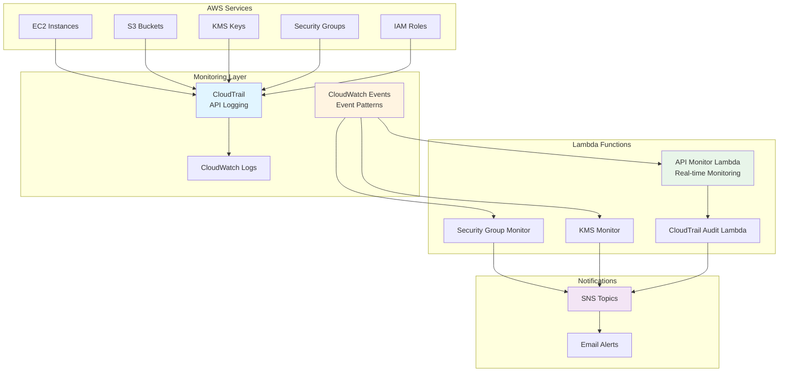
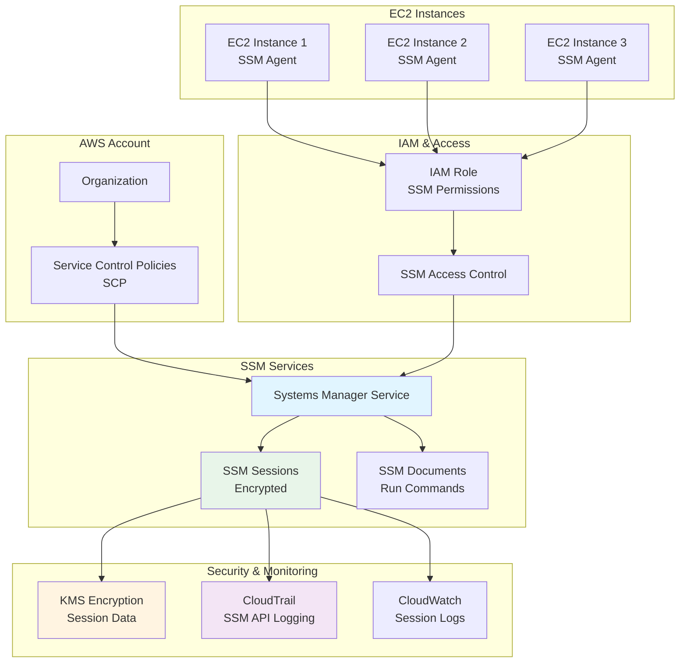
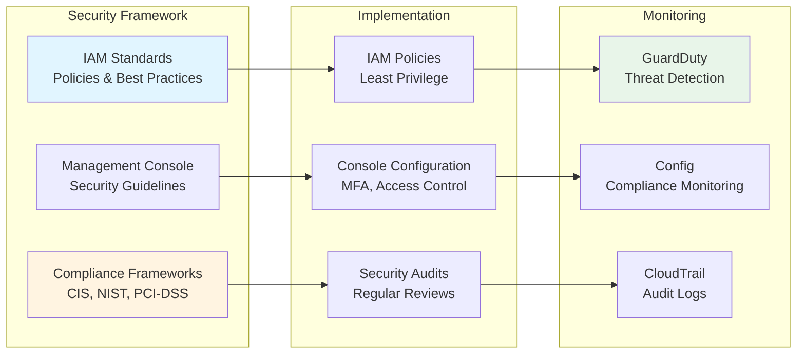

# AWS Tools

> Consolidated repository for AWS-related tools and security standards

## 📋 Overview

This repository consolidates AWS-related tools, Lambda functions, and security standards for cloud infrastructure management and monitoring.

## 🏗️ Architecture

### AWS API Monitoring Architecture



### Amazon Systems Manager (SSM) Architecture



### AWS Security Standards Architecture



## 📁 Projects

### [Lambda](./Lambda/)

AWS Lambda functions for automation, monitoring, and security.

**Key Projects:**

1. **AWS API Real-time Monitoring**
   - Real-time monitoring of AWS API activities
   - CloudTrail log auditing
   - Security group and KMS key monitoring
   - CloudWatch Events integration
   - Lambda functions for event forwarding

2. **Amazon Systems Manager (SSM) Implementation**
   - SSM agent installation and configuration
   - IAM roles and security policies
   - Service Control Policies (SCP)
   - Session encryption and logging
   - Secure instance management

**Lambda Functions:**
- `AWS-API-Monitor/` - API monitoring and CloudTrail auditing
- `SSM/` - Systems Manager configuration
- `Config_lambda_function.py` - AWS Config integration
- `Guardduty_lambda.function.py` - GuardDuty integration

### [security_standards](./security_standards/)

AWS security standards, compliance guidelines, and best practices.

**Components:**
- IAM policies and best practices
- Management Console security
- Compliance frameworks
- Security configuration guides

## 🚀 Quick Start

### Prerequisites

- AWS Account with appropriate permissions
- AWS CLI configured
- Python 3.x
- Required AWS services enabled (Lambda, CloudWatch, CloudTrail, etc.)

### Lambda Function Deployment

1. **Clone and Navigate**
   ```bash
   git clone https://github.com/Twodragon0/aws-tools.git
   cd aws-tools/Lambda
   ```

2. **Install Dependencies**
   ```bash
   pip install -r requirements.txt
   # Or use environment.yml for conda
   conda env create -f environment.yml
   ```

3. **Deploy Lambda Function**
   ```bash
   # Package the function
   zip -r lambda_function.zip lambda_function.py
   
   # Deploy using AWS CLI
   aws lambda create-function \
     --function-name my-function \
     --runtime python3.9 \
     --role arn:aws:iam::account-id:role/lambda-role \
     --handler lambda_function.lambda_handler \
     --zip-file fileb://lambda_function.zip
   ```

### AWS API Monitoring Setup

Refer to the [API-Monitor Guide](./Lambda/AWS-API-Monitor/README.md) for detailed setup instructions.

### SSM Implementation

Refer to the [SSM Guide](./Lambda/SSM/readme.md) for complete SSM setup and configuration.

## 📖 Documentation

### Lambda Functions

- [AWS API Monitor README](./Lambda/AWS-API-Monitor/README.md) - API monitoring setup
- [Lambda Project Overview](./Lambda/README.md) - General Lambda project information
- [SSM Implementation Guide](./Lambda/SSM/readme.md) - Systems Manager setup

### Security Standards

- [IAM Policies](./security_standards/IAM/Readme.md) - IAM best practices
- [Management Console](./security_standards/Management_Console/readme.md) - Console security
- [Security Standards Overview](./security_standards/Readme.md) - General security guidelines

## 🔒 Security Considerations

### IAM Best Practices

- Follow principle of least privilege
- Use IAM roles instead of access keys when possible
- Enable MFA for sensitive operations
- Regularly rotate credentials
- Audit IAM policies regularly

### Lambda Security

- Use IAM roles with minimal required permissions
- Encrypt environment variables using KMS
- Enable VPC configuration for private resources
- Implement proper error handling
- Enable CloudWatch Logs encryption

### Monitoring and Compliance

- Enable CloudTrail for all regions
- Set up CloudWatch alarms for critical events
- Implement GuardDuty for threat detection
- Use AWS Config for compliance monitoring
- Regular security audits

## 📝 Project Structure

```
aws-tools/
├── Lambda/
│   ├── AWS-API-Monitor/     # API monitoring functions
│   ├── SSM/                  # Systems Manager setup
│   ├── Config_lambda_function.py
│   ├── Guardduty_lambda.function.py
│   └── README.md
├── security_standards/
│   ├── IAM/                  # IAM policies and guides
│   ├── Management_Console/  # Console security
│   └── Readme.md
└── README.md
```

## 🧪 Testing

### Local Testing

```bash
# Install test dependencies
pip install -r requirements.txt

# Run tests
python -m pytest tests/
```

### Lambda Testing

Use AWS SAM or serverless framework for local Lambda testing:

```bash
sam local invoke FunctionName
```

## 📝 License

Please refer to individual project licenses.

## 👤 Author

**Twodragon**
- GitHub: [@Twodragon0](https://github.com/Twodragon0)
- Blog: [twodragon.tistory.com](https://twodragon.tistory.com)

## 🤝 Contributing

Contributions are welcome! Please feel free to submit a Pull Request.

## ⚠️ Important Notes

- **Security**: Never commit AWS credentials or access keys
- **Testing**: Always test Lambda functions in a development environment first
- **Compliance**: Ensure all implementations follow AWS security best practices
- **Documentation**: Update documentation when making changes

---

**Last updated:** 2025-12-27
